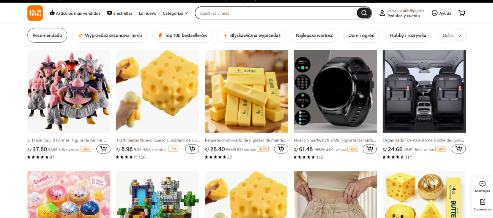
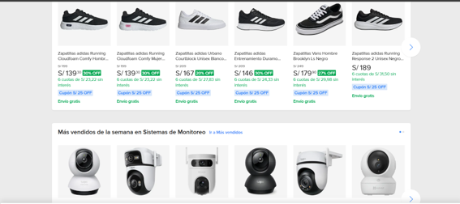

---
title: "TEORIA GENERAL DE SISTEMAS APLICADA A UNA TIENDA VIRTUAL"
description: "Identificación de entradas, procesos, salidas y retroalimentación en un entorno de comercio electrónico."
pubDate: 2026-09-10
tags: ["UNSM", "Teoría General de Sistemas", "Investigación"]
---

> **“AÑO DE LA ESPERANZA Y EL FORTALECIMIENTO DE LA DEMOCRACIA"**  
> **UNIVERSIDAD NACIONAL DE SAN MARTÍN**  
> **FACULTAD DE INGENIERÍA DE SISTEMAS E INFORMÁTICA**  
> **ESCUELA DE INGENIERÍA DE SISTEMAS E INFORMÁTICA**  

---

- **Semestre Académico:** 2026 – II
- **Tema:** Teoría General de Sistemas aplicada a una Tienda Virtual
- **Ciclo:** IV
- **Asignatura:** Teoría General de Sistemas
- **Docente:** Ing. Dr. Alberto Alva Arévalo
- **Estudiante:** Sandoval Ramirez, Fatima Esther
- **Lugar y Año:** MORALES – PERÚ – 2026

📎 **[Enlace al trabajo original en Google Drive](https://docs.google.com/document/d/1aE-H4kSi0na5BmXduwXN15EbZCff8upR/edit?usp=sharing&ouid=108245045523548260456&rtpof=true&sd=true)**
---
## Índice

- [I. Introducción](#i-introducción)
- [II. Objetivos](#ii-objetivos)
- [III. Esquema Sistémico del Comercio Electrónico](#iii-esquema-sistémico-del-comercio-electrónico)
- [IV. Descripción de Componentes](#iv-descripción-de-componentes)
- [V. Conclusiones](#v-conclusiones)
- [VI. Referencias Bibliográficas](#vi-referencias-bibliográficas)
- [VII. Anexos](#vii-anexos)

---

## I. INTRODUCCIÓN

Hoy en día interactuamos con tiendas virtuales a diario para comprar desde cualquier lugar, pero pocas veces nos detenemos a pensar todo lo que pasa detrás de la pantalla para que un paquete llegue a casa.

En este trabajo analizamos una tienda virtual aplicando la Teoría General de Sistemas. La idea es ver el comercio electrónico y no solo limitarnos a verlo como una página web, sino como una red de partes conectadas donde los datos que ingresan, los procesos de compra, las entregas y la opinión de los clientes colaboran en conjunto para que todo funcione sin fallas.

---

## II. OBJETIVOS

- **Facilitar la comercialización:** Permitir la compra y venta de bienes y servicios a través de plataformas digitales, garantizando un proceso ágil de selección, pago seguro y entrega de manera eficiente al consumidor final.
- **Optimizar la experiencia de usuario:** Reducir los pasos y tiempos de navegación mediante una interfaz intuitiva que permita al usuario encontrar productos con facilidad.
- **Garantizar la seguridad transaccional:** Proteger la información sensible del usuario y procesar los pagos mediante protocolos de cifrado y pasarelas verificadas para evitar fraudes.
- **Coordinar inventario y logística:** Sincronizar el inventario físico con el catálogo digital y brindar al cliente el estado exacto de su pedido desde el empaque hasta la entrega final.
- **Fortalecer la fidelización:** Establecer canales ágiles de soporte, resolución de incidencias y gestión de devoluciones para construir confianza a largo plazo.

---

## III. ESQUEMA SISTÉMICO DEL COMERCIO ELECTRÓNICO

El siguiente esquema resume los cinco componentes principales que articulan el funcionamiento de una tienda virtual:

| Fase | Nombre | Elementos principales |
| :---: | :--- | :--- |
| **1** | **Entradas** | Datos de clientes y registro, catálogo de productos y stock, pedidos y carritos, datos de pago bancario. |
| **2** | **Procesos** | Búsqueda y filtrado de productos, validación de cobro en pasarela, actualización de stock en almacén, embalaje del pedido. |
| **3** | **Salidas** | Entrega del producto al comprador, comprobante (factura/boleta), código de rastreo (tracking), reportes de ventas generados. |
| **4** | **Retroalimentación** | Reseñas y calificaciones del cliente, tasa de carritos abandonados, gestión de reclamos y devoluciones, monitoreo de tiempos de entrega. |
| **5** | **Entorno y Subsistemas** | *Subsistemas:* Web/App, pagos, inventario, logística y soporte. *Entorno:* Bancos, couriers, proveedores mayoristas, marco regulatorio y competencia. |

---

## IV. DESCRIPCIÓN DE COMPONENTES

- **Entradas:** Datos personales y de facturación del cliente, catálogo de productos disponible, órdenes de compra generadas y credenciales de pago validadas.
- **Procesos:** Filtro y búsqueda en plataforma, validación de pasarela de pago, control de inventario en almacén y preparación física de paquetes (picking y packing).
- **Salidas:** Bienes o servicios recibidos por el usuario, comprobantes tributarios (boletas/facturas), códigos de seguimiento en ruta y balances de ventas generados.
- **Retroalimentación:** Calificaciones directas del comprador, registro y causas de carritos abandonados, solicitudes de devolución y monitoreo de plazos de entrega.
- **Subsistemas:** Plataforma web o aplicación móvil, pasarela de pago, almacén y stock, logística de transporte y módulo de atención posventa.
- **Entorno:** Red bancaria, proveedores de transporte y courier, proveedores mayoristas, leyes de protección al consumidor y competencia del mercado digital.

---

## V. CONCLUSIONES

Al final, este análisis deja claro que una tienda virtual es más que una web interesante y atractiva. La verdad es que detrás de este proceso de compra hay un engranaje completo donde si algo falla —como un retraso en el envío (courier) o una caída en los pagos—, toda la experiencia se viene abajo.

Verlo desde un enfoque de sistemas ayuda a entender que ninguna parte funciona aislada: la tecnología, el almacén y el soporte deben trabajar con coordinación a la perfección para que el pedido llegue bien y el cliente quede satisfecho.

---

## VI. REFERENCIAS BIBLIOGRÁFICAS

- **WebTienda.** (s. f.). *Cómo se manejan los envíos en una tienda virtual*. Blog WebTienda. [https://webtienda.ar/blog/como-se-manejan-los-envios-en-una-tienda-virtual](https://webtienda.ar/blog/como-se-manejan-los-envios-en-una-tienda-virtual)
- **Otero, C.** (2026, 27 mayo). *¿Cómo funciona una tienda virtual por dentro: del pedido a la entrega en Lima?* KOM Agencia Digital. [https://kom.pe/como-funciona-tienda-virtual-por-dentro-peru/](https://kom.pe/como-funciona-tienda-virtual-por-dentro-peru/)

---
## VII. ANEXOS

---

### Material complementario

#### Documento Completo
* 📄 [Leer Trabajo Completo en Google Drive](https://docs.google.com/document/d/1aE-H4kSi0na5BmXduwXN15EbZCff8upR/edit?usp=sharing&ouid=108245045523548260456&rtpof=true&sd=true)