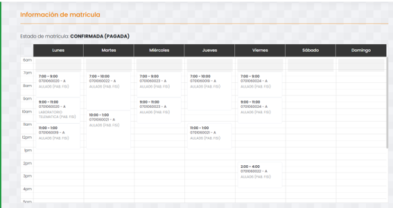

> **“AÑO DE LA ESPERANZA Y EL FORTALECIMIENTO DE LA DEMOCRACIA"**  
> **UNIVERSIDAD NACIONAL DE SAN MARTÍN**  
> **FACULTAD DE INGENIERÍA DE SISTEMAS E INFORMÁTICA**  
> **ESCUELA DE INGENIERÍA DE SISTEMAS E INFORMÁTICA**  

---

- **Semestre Académico:** 2026 – II
- **Tema:** Percepción estudiantil sobre la deficiencia en los sistemas de pago y gestión académica (SIGAU) en la Universidad Nacional de San Martín en el periodo 2026-I.
- **Ciclo:** IV
- **Asignatura:** Teoría General de Sistemas
- **Docente:** Ing. Dr. Alberto Alva Arévalo
- **Estudiante:** Sandoval Ramirez, Fatima Esther
- **Lugar y Año:** MORALES – PERÚ – 2026

📎 **[Enlace al trabajo original en Google Drive](https://drive.google.com/file/d/1qzEesLkC4OI4Y5O0nmNFprL0tmvzDRGh/view?usp=sharing)**

---

## Índice

- [I. Introducción](#i-introducción)
- [II. Problemática](#ii-problemática)
- [III. Solución a la Problemática](#iii-solución-problemática)
- [IV. Conclusiones](#iv-conclusiones)
- [V. Recomendaciones](#v-recomendaciones)
- [VI. Referencias Bibliográficas](#vi-referencias-bibliográficas)
- [VII. Anexos](#vii-anexos)

---

## I. INTRODUCCIÓN

Comenzar un nuevo ciclo en la UNSM debería ser un proceso sencillo, pero para la mayoría de los estudiantes se ha convertido en una auténtica fuente de estrés y desgaste físico. Aunque existen dos opciones para pagar la matrícula, acudir directamente a las ventanillas de la universidad o hacerlo a través del banco BBVA, en la práctica ninguna de las dos alternativas ofrece una solución rápida ni eficiente. Por el contrario, ambas vías terminan colapsando al mismo tiempo, dejando al alumnado atrapado entre la inestabilidad de las plataformas virtuales y la mala organización presencial.

La realidad que se vive en el campus durante estas fechas es bastante dura. Quienes deciden pagar en la misma universidad se encuentran con colas interminables que avanzan a paso lento, obligando a cientos de jóvenes a esperar durante horas bajo el sol y el calor sofocante, una exposición constante que no solo agota, sino que representa un riesgo real para la salud. A esto se suma que la alternativa bancaria tampoco es una garantía, ya que el sistema del BBVA se cae con frecuencia por la alta demanda. Para empeorar la situación, cuando los estudiantes finalmente logran pagar y entrar al SIGAU, el sistema no solo sufre caídas constantes, sino que a menudo presenta cambios repentinos en los horarios y en la distribución de las asignaturas, generando una enorme confusión e impidiendo armar un horario con claridad.

Toda esta serie de fallas técnicas y administrativas crea una profunda sensación de incertidumbre y desprotección en la comunidad universitaria. Por ello, este trabajo tiene como objetivo analizar la percepción de los estudiantes frente al proceso de pagos y matrículas en la UNSM, visibilizando cómo las fallas en el SIGAU, los problemas con el banco y las largas esperas en el campus afectan directamente tanto el bienestar físico de los alumnos como su tranquilidad académica.

---

## II. PROBLEMÁTICA

El proceso de matrícula en la UNSM presenta una desconexión crítica entre la capacidad operativa de la institución y la demanda de la comunidad universitaria. Los estudiantes se encuentran atrapados en un círculo vicioso: acudir a la sede central implica soportar colas que rodean pabellones bajo temperaturas que superan los 30 °C, exponiéndose a golpes de calor y deshidratación; sin embargo, recurrir a los canales del BBVA tampoco garantiza fluidez, pues la plataforma suele colapsar ante el volumen de transacciones simultáneas.

A este panorama de desgaste físico y virtual se suma la inestabilidad del SIGAU. La lentitud en la validación de los pagos, sumada a la modificación imprevista de horarios y cruces de asignaturas sin previo aviso, deja a los alumnos en un estado de incertidumbre constante respecto a la continuidad regular de su plan de estudios.

| Dimensión | Falla identificada | Impacto directo en el estudiante |
| :--- | :--- | :--- |
| **Pago presencial (UNSM)** | Insuficiencia de ventanillas y lentitud administrativa. | Esperas de varias horas bajo el sol y calor extremo; agotamiento físico y riesgo para la salud. |
| **Pago bancario (BBVA)** | Caídas recurrentes del servicio por congestión de usuarios. | Imposibilidad de pagar a tiempo en agentes o banca móvil; viajes en vano a sucursales. |
| **Plataforma SIGAU** | Servidores saturados y falta de sincronización en tiempo real. | Bloqueo en la selección de cursos, pérdida de vacantes planificadas y cierre intempestivo de sesiones. |
| **Gestión académica** | Modificaciones repentinas de horarios, grupos y docentes en el sistema. | Cruces de materias de última hora, desinformación y necesidad de rehacer la matrícula de emergencia. |

---

## III. SOLUCIÓN PROBLEMÁTICA

### 1. Descongestión del pago presencial y protección al alumno
- **Habilitación de puntos de pago en ambientes techados:** Trasladar o ampliar las ventanillas de tesorería hacia auditorios, polideportivos o pabellones ventilados con asientos, evitando que las filas se formen al aire libre bajo el calor extremo.
- **Sistema de tickets numerados o turnos por horario:** Implementar un dispensador de citas o turnos virtuales para el pago presencial, de modo que el estudiante acuda a una hora fija sin necesidad de esperar horas de pie.

### 2. Diversificación bancaria y pagos digitales
- **Integración de billeteras digitales (Yape / Plin):** Permitir el pago directo de la tasa mediante código QR vinculado a la cuenta recaudadora de la universidad, eliminando la obligación de ir a ventanilla o usar un agente.
- **Convenios con múltiples entidades bancarias:** No limitar la recaudación al BBVA; incorporar al Banco de la Nación, agentes de proximidad y pasarelas con tarjeta de débito dentro de la misma web institucional para repartir la carga operativa.

---

## IV. CONCLUSIONES

1. **El impacto físico de las colas y la necesidad de una atención digna:** Se ve claro que las filas presenciales no son solo una pérdida de tiempo, sino un problema de bienestar estudiantil por las largas horas de espera bajo el calor intenso. Por eso, la universidad debe dejar de atender a la intemperie. La universidad debe crear espacios cubiertos con asientos y usar un sistema de turnos numerados para que ningún estudiante arriesgue su salud por un trámite administrativo.
2. **La fragilidad del sistema digital y la urgencia de diversificar pagos:** Depender de una sola entidad bancaria y de un SIGAU inestable deja a los alumnos en una incertidumbre constante con respecto a sus horarios y vacantes. Para poder erradicar este problema es indispensable que la institución amplíe sus convenios con otros bancos y habilite métodos rápidos como billeteras digitales (Yape, Plin), permitiendo que el registro sea automático y no dependa de plataformas propensas a colapsar.
3. **La falta de previsión académica frente a la organización escalonada:** Las modificaciones imprevistas en los horarios y la saturación de las plataformas demuestran una falta de sincronización previa al inicio del ciclo. La solución más viable no pasa por renovar todo el sistema de golpe, sino por organizar un cronograma escalonado por facultades y fijar el horario con antelación, logrando un proceso transparente y evitando el cruce de horarios.

---

## V. RECOMENDACIONES

1. **Acondicionar la atención presencial para cuidar la salud pública:** Reubicar las cajas a espacios techados, amplios y ventilados con asientos y sistema de turnos moderados, evitando de esta manera que los estudiantes pasen horas expuestos al sol y al calor.
2. **Diversificar las formas de pago:** Implementar pagos rápidos por billeteras digitales (Yape, Plin) y convenios con más entidades bancarias o agentes locales para que no solo dependa del BBVA y no colapse la recaudación.
3. **Reforzar los servidores y estabilidad del SIGAU:** Realizar mantenimiento previo y aumentar la capacidad del sistema durante la semana de matrícula para evitar cierres de sesión, caídas de la página y retrasos en la validación del abono.
4. **Congelar horarios y planificar fechas:** Publicar los horarios definitivos con días de anticipación sin hacer cambios de última hora, y organizar el proceso de matrícula por facultades o ciclo para que no todos se intenten registrar al mismo tiempo.

---

## VI. REFERENCIAS BIBLIOGRÁFICAS

- **Banco Central de Reserva del Perú.** (2025, septiembre). *Reporte del Sistema Nacional de Pagos (Setiembre 2025)*. [https://www.bcrp.gob.pe/...](https://www.bcrp.gob.pe/publicaciones/reporte-del-sistema-nacional-de-pagos/rspf-setiembre-2025.html)
- **Organización Mundial de la Salud [OMS].** (2022). *Radiación ultravioleta y efectos sobre la salud pública*. OMS. [https://www.who.int/...](https://www.who.int/es/news-room/fact-sheets/detail/ultraviolet-radiation)
- **Servicio Nacional de Meteorología e Hidrología del Perú [SENAMHI].** (2022). *Guía climática y niveles de radiación ultravioleta en la región San Martín*. Ministerio del Ambiente. [https://www.senamhi.gob.pe](https://www.senamhi.gob.pe)
- **Valles-Coral, M. A., Calampa-Tantachuco, C., Hernández-Torres, E. A., Galvez-Diaz, M. A., & Garcia-Bautista, A. M.** (2023). *Plataforma de matrículas del Centro de Tecnologías de Información de una universidad peruana en el contexto de la COVID-19*. Revista Cubana de Información en Ciencias de la Salud, 34, e2174. [https://acimed.sld.cu/...](https://acimed.sld.cu/index.php/acimed/article/view/2174)

---

## VII. ANEXOS

